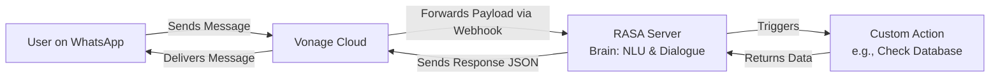

RASA + Vonage multi-channel customer service bot.

**Quick Start:**

**Option 1: Automated Setup (Recommended)**
   - Run: `.\start-demo.ps1` (PowerShell script that sets up everything)
   - Follow the prompts to open 3 terminals automatically
   - Run the suggested commands in each terminal

**Option 2: Manual Setup**
1) **Install Dependencies & Setup**
   ```powershell
   npm install
   cd "rasa_customer_care chatbot"
   python -m venv .venv
   .venv\Scripts\activate
   pip install -r requirements.txt
   rasa train
   cd ..
   ```

2) **Start Services (3 separate terminals)**
   ```powershell
   # Terminal 1 - Node.js Server
   npm run start
   
   # Terminal 2 - RASA Actions Server  
   npm run rasa:actions
   
   # Terminal 3 - RASA Core Server
   npm run rasa:server
   ```

3) **Demo the Bot**
   - Visit: http://localhost:3000
   - Try: "Hello", "track order #12345", "Where is my order?"
   - Use "Simulate inbound" for WhatsApp/SMS testing
   - **Works offline** - includes intelligent fallback responses!

**Technical Notes:**
 - RASA model includes advanced order tracking with form handling and custom actions
 - Node.js server provides web UI, webhook handling, and fallback responses
 - Real-time activity monitoring with webhook payload logging

Vonage ↔ Rasa wiring (WhatsApp/SMS)
1) Create a Vonage application with Messages enabled
   - In the Vonage Dashboard, create an Application and enable Messages
   - Generate and download the private key (save path as private.key or .pem)
   - Link your WhatsApp business sender or provision an SMS number

2) Configure environment
   - Create a .env file in project root:
     VONAGE_APPLICATION_ID=your-app-id
     VONAGE_PRIVATE_KEY_PATH=./private.key
     VONAGE_WHATSAPP_NUMBER=14155550100
     VONAGE_SMS_NUMBER=14155550100
     RASA_REST_WEBHOOK=http://localhost:5005/webhooks/rest/webhook

3) Set webhooks in Vonage
   - Inbound URL: http://YOUR_PUBLIC_URL/webhooks/inbound-message
   - Status URL: http://YOUR_PUBLIC_URL/webhooks/message-status
   - Use a tunnel in dev (e.g., `npx localtunnel --port 3000` or `ngrok http 3000`)

4) Test
   - Send a WhatsApp/SMS to your configured number
   - The Node server forwards the text to Rasa and relays back Rasa replies via Vonage

Here is a breakdown of the main idea, explained for a "RASA + Vonage" implementation.

### The Core Idea: A Unified AI Brain with Omnichannel Voices

The main idea is to use **RASA** as the intelligent "brain" of your customer service operation and **Vonage APIs** as its "voices and ears" across different communication channels.

1.  **RASA (The Brain):** This is your open-source AI engine. It runs on your server and is responsible for all the heavy lifting:
    *   **Natural Language Understanding (NLU):** It parses incoming user messages from any channel to understand the user's **intent** (e.g., `track_order`, `request_refund`) and extracts key data, called **entities** (e.g., `order_number: #12345`).
    *   **Dialogue Management:** It holds the conversation's state. Based on the intent, entities, and what happened previously in the conversation, it decides what the bot should do or say next. This is where your custom logic and workflows live.
    *   **Custom Actions:** For complex tasks (like checking a database, calling an external API for shipping status, or performing a calculation), RASA can run Python code.

2.  **Vonage APIs (The Voices & Ears):** Vonage acts as the bridge between your RASA brain and the outside world. It handles the telecom complexity for you.
    *   **Channel Integration:** The Vonage Messages API lets your RASA bot send and receive messages on channels like **WhatsApp, SMS, Facebook Messenger, and Viber** without you having to build individual integrations for each one.
    *   **Message Routing:** Vonage receives a message from a user on, say, WhatsApp. It then forwards this message to your RASA webhook. When RASA replies with a response, Vonage takes that response and sends it back to the user on WhatsApp.

---

### How It Works: The Technical Flow

Here is the step-by-step data flow for a user asking "Where is my order #12345?" on WhatsApp:

1.  **User Initiates:** A customer sends the message to your Vonage-provided WhatsApp number.
2.  **Vonage Receives:** Vonage's cloud receives the message.
3.  **Webhook Trigger:** Vonage immediately sends a structured JSON payload (containing the message text and sender info) to a **webhook URL** that you've configured. This URL points to your RASA server.
4.  **RASA Processes:** Your RASA server receives the payload.
    *   The Rasa NLU model understands the intent is `track_order` and extracts the entity `order_number: 12345`.
    *   The dialogue management determines the next step is to run a `custom action`.
5.  **Custom Action Runs:** A Python function (`action_check_order_status`) is triggered. It uses the `order_number` to query your database or order management system's API to get the shipping status.
6.  **RASA Formulates Response:** The custom action returns the result (e.g., `"Your order is out for delivery."`) to the RASA core.
7.  **Response to Vonage:** RASA sends a JSON response back to Vonage's webhook. This response contains the text to send to the user.
8.  **Vonage Delivers:** Vonage takes the text from RASA and delivers it to the user's WhatsApp number, completing the cycle.

